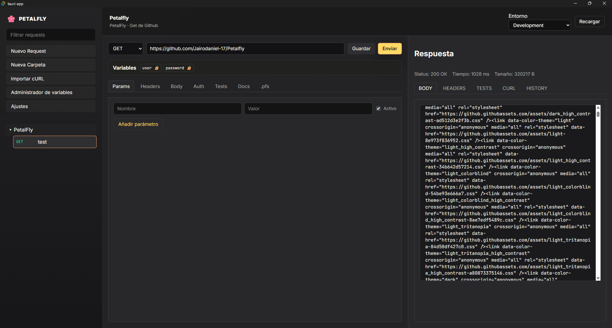
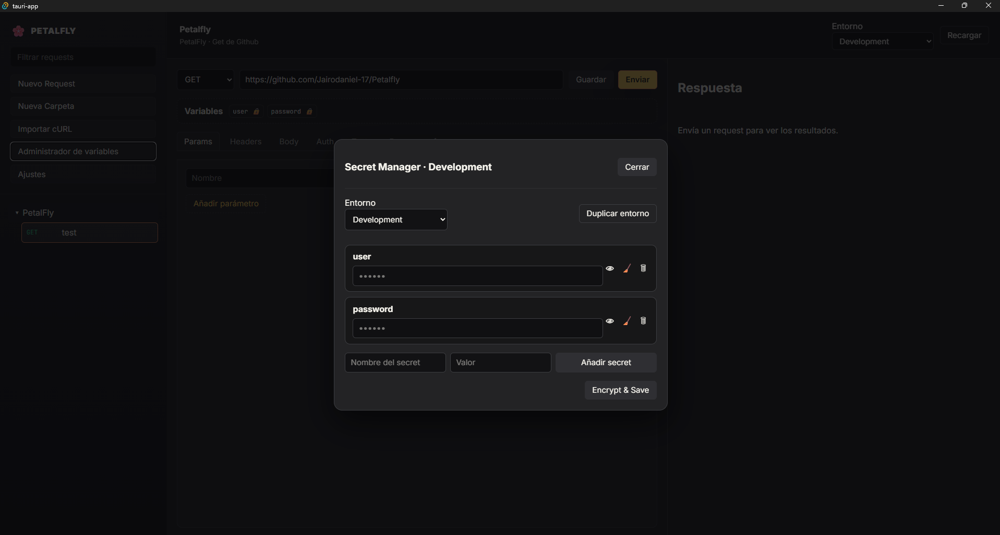

# Petalfly

Petalfly es un cliente de APIs 100 % local-first. Todos los requests, entornos y settings viven como archivos planos dentro del workspace, listos para versionarse en Git. La aplicación combina React + Tauri + Rust para ofrecer un shell de escritorio privado, sin telemetría ni dependencias cloud.




> Las capturas se generan al ejecutar `pnpm tauri dev` con el workspace de ejemplo. Pueden actualizarse desde `docs/`.

## Características

- 🗂️ Árbol completo de colecciones basado en `/workspace/collections`
- ✍️ Editor tabulado estilo Postman para Params, Headers, Body, Auth, Tests, Docs y Raw `.pfs`
- 📚 Parser bidireccional de Petalfly Script 1.0 (YAML-like + bloques `"""`)
- 🔐 Secret Manager con cifrado ChaCha20-Poly1305 + PBKDF2 y master password en memoria
- ⚙️ Settings avanzados: tema, timeout, SSL, historial, debug logs
- 📜 Historial por request (`workspace/history/<requestId>.json`) con restauración de payload
- 🧪 Test runner visual con JSONPath, status, headers y body assertions
- 📤 Exportador a curl 100 % equivalente + importador curl → `.pfs`
- 🧵 Respuesta con tabs: Body pretty/raw, Headers, Tests, Curl, History
- 🪶 UI inspirada en pétalos flotando (gradientes suaves + tipografía JetBrains Mono)

## Tecnologías

- **Frontend:** React 19 + Vite + Zustand + React Markdown
- **Backend:** Tauri 2 + Rust (`reqwest`, `serde_yaml`, `chacha20poly1305`)
- **Lenguaje:** Petalfly Script (`petalfly 1.0`) con parser propio y tests

## Requisitos

- Node.js 20+ y pnpm 9+
- Rust estable + toolchains requeridos por Tauri (MSVC en Windows, Xcode CLI en macOS)
- Workspace accesible en disco (por defecto `./workspace`)

## Primeros pasos

```bash
pnpm install
pnpm tauri dev
```

El workspace inicial incluye:

- `collections/sample.pfs` – request de demo
- `environments/env.dev.yaml` – entorno con un secret (`token`)
- `globals.yaml` – variables globales
- `settings.json` – configuración general

## Scripts

| Script | Descripción |
|--------|-------------|
| `pnpm tauri dev` | Ejecuta Petalfly en modo escritorio con recarga en vivo |
| `pnpm build` | Empaqueta el frontend (Vite) |
| `pnpm test` | Ejecuta Vitest (parser, resolver, curl, test runner) |
| `pnpm tauri build` | Genera instaladores nativos |
| `cargo test --manifest-path src-tauri/Cargo.toml` | Pruebas Rust (FS, history, crypto) |

## Lenguaje `.pfs`

```yaml
petalfly 1.0
meta:
  id: get-user
  name: Get User
  collection: Demo
  tags: [users]
  description: Obtiene un usuario
request:
  method: GET
  url: "{{baseUrl}}/users/{{userId}}"
  headers:
    Accept: application/json
  query:
    pretty:
      value: true
      enabled: true
  body:
    type: none
docs: """
## Documentación
Se permite markdown renderizado en vivo.
"""
tests:
  - name: status 200
    expect:
      status: 200
examples:
  - name: curl
    curl: |
      curl -X GET "{{baseUrl}}/users/{{userId}}"
```

- Variables: `{{nombre}}` → se resuelven con entornos (`environments/*.yaml`) + `globals.yaml`
- `docs` usa bloques `"""`. Cualquier bloque `|` se conserva como texto multilínea
- Tests soportan `status`, `header.contains/equals`, `body.contains`, `json.path/type/equals`

## Secrets y entornos

1. Ve a **Secret Manager** y define la master password (solo vive en memoria).
2. Crea secrets (`secret: true`) dentro del entorno activo.
3. Usa `Reveal` para verlos temporalmente; `Encrypt & Save` los persiste cifrados en YAML.
4. Durante la ejecución, los secrets se descifran en memoria y nunca se guardan en logs.

Los entornos se almacenan como YAML/JSON en `workspace/environments`. Todos los secrets se escriben cifrados; el valor plano se mantiene en caché mientras la app está abierta.

## Árbol de colecciones

El sidebar refleja exactamente la estructura de `workspace/collections` (subcarpetas + `.pfs`). Desde el menú puedes:

- Crear carpetas/requests
- Duplicar, renombrar o eliminar archivos
- Importar un `curl` y convertirlo automáticamente a `.pfs`

## Respuesta e historial

- **Body:** formato pretty para JSON, fallback raw.
- **Headers:** tabla key/value.
- **Tests:** resultados del runner + botón “Run Tests Again” (sin re-ejecutar HTTP).
- **Curl:** comando equivalente al request enviado (copy to clipboard).
- **History:** últimos `N` resultados (configurable) con timestamp, status y botón “Restore” para volver a un payload anterior.

Cada request guarda su historial en `workspace/history/<requestId>.json`.

## Importar / Exportar curl

- **Export:** pestaña “Curl” del panel de respuesta → `Copy`.
- **Import:** botón “Importar cURL” en el sidebar → pega un comando, se crea un `.pfs` con meta e inferencias de headers/body.

## Estructura del repo

```shell
workspace/
  collections/
  environments/
  globals.yaml
  history/
  settings.json
src/
  components/        # Sidebar, tabs, modales
  services/          # pfsParser, variableResolver, httpClient, curl
  store/useAppStore  # Zustand + lógica de dominio
src-tauri/
  commands/fs.rs     # FS, settings, env, collections
  crypto.rs          # ChaCha20-Poly1305 + PBKDF2
  history.rs         # Persistencia de historiales
  http_client.rs     # reqwest + métricas
```

## Tests

- Parser, resolver, test runner y curl conversion están cubiertos con Vitest.
- Rust valida FS, parseo `.pfs`, guardado y lectura de workspace, además del módulo de history.

## Licencia

[MIT](./LICENSE)
